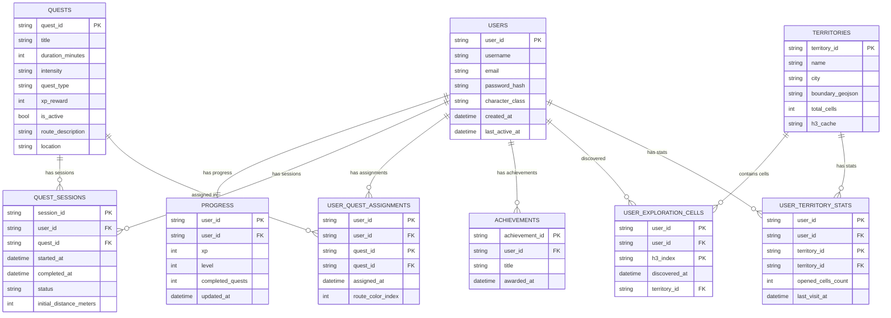
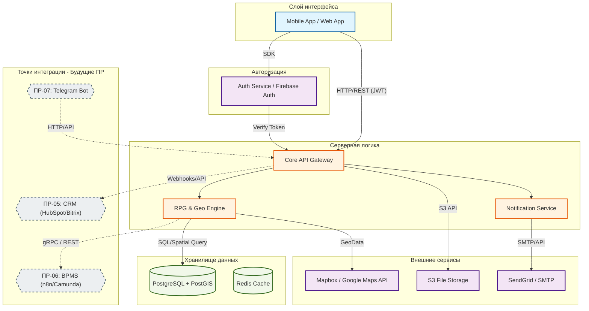
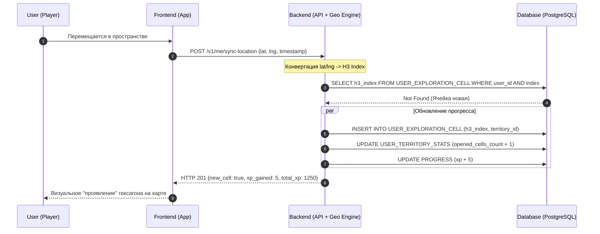
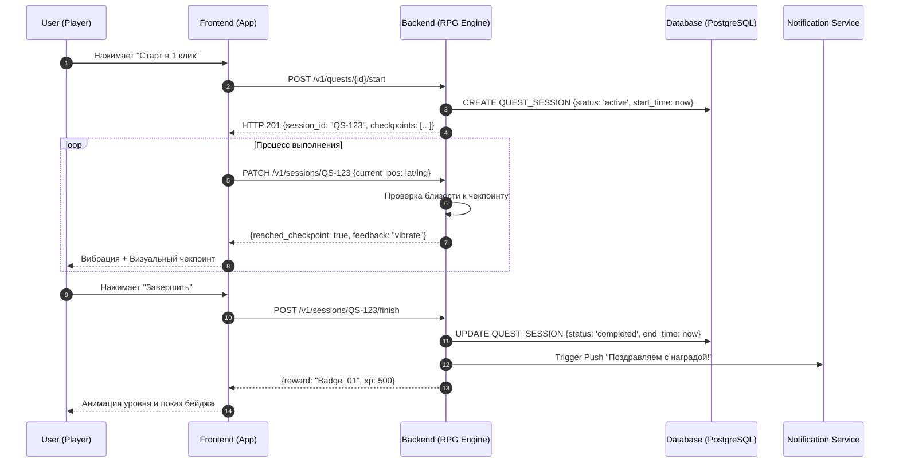

Данный документ содержит описание структуры данных, системной архитектуры и логики движения данных (Data Flow) для реализации механики гексагонального исследования города.

---

## 1. ER-диаграмма (Схема базы данных)
Описывает структуру таблиц, связи и ключевые атрибуты сущностей. Основной упор сделан на эффективное хранение геоданных через индексы H3.

---

## 2. Диаграмма архитектуры
Общая схема взаимодействия компонентов системы: от мобильного приложения до внешних сервисов и точек интеграции.

---

## 3. Data Flow Diagram Сценарий 1: Синхронизация локации и "закрашивание" карты
Логика превращения GPS-координат в игровой прогресс в реальном времени.

---

## 4. Data Flow Diagram Сценарий 2: Выполнение квеста и получение наград
Процесс прохождения игровых активностей с обратной связью.

